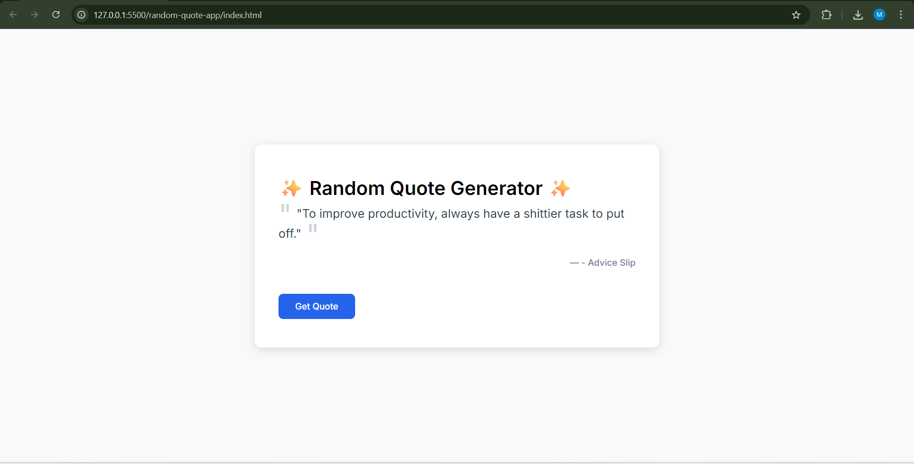
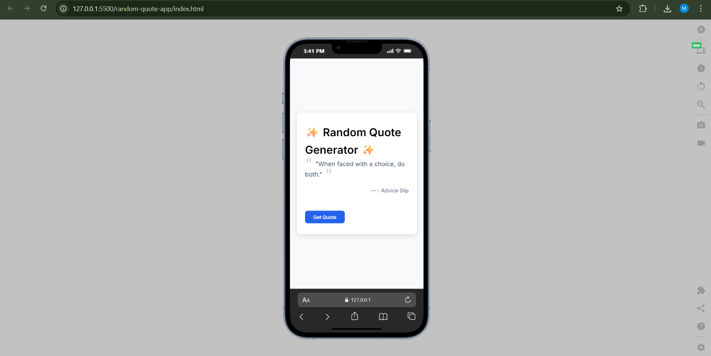

# ✨ Random Quotes App

A simple and elegant web application that generates random inspirational quotes and life advice with a clean, professional interface.

## 🎯 Features

- 🎲 Generate random quotes with a single click
- 🎨 Clean and modern UI design
- 📱 Fully responsive layout for mobile and desktop
- ⚡ Smooth animations and transitions
- 🚀 Fast loading with no dependencies
- 💡 Motivational content for daily inspiration

## 🧠 Technologies Used

- HTML5
- CSS3 (Flexbox, Animations, Custom Properties)
- JavaScript ES6+ (Modules, Async-Await, Fetch API)
- Advice Slip API

## 📁 Project Structure

```
random-quotes-app/
├── js/
│   ├── api.js           # API fetch logic
│   ├── ui.js            # UI update functions
│   └── main.js          # Main application logic
├── style/
│   └── styles.css       # All styling and responsive design
├── index.html           # Main HTML file
└── README.md            # Project documentation
```

## 🌐 API Documentation

This application uses the **Advice Slip API** to fetch random quotes and advice.

### API Endpoint Used:

```
https://api.adviceslip.com/advice
```

- Documentation: [Advice Slip API](https://api.adviceslip.com/)
- No API key required
- Free to use
- Returns JSON response with advice text

### API Response Example:

```json
{
  "slip": {
    "id": 123,
    "advice": "Your advice text here."
  }
}
```

## 🚀 How to Run

1. **Clone this repository**
```bash
git clone https://github.com/yourusername/random-quotes-app.git
```

2. **Navigate to project directory**
```bash
cd random-quotes-app
```

3. **Open the application**
   - Simply open `index.html` in your web browser
   - Or use a local server:
```bash
# Using Python
python -m http.server 8000

# Using Node.js (http-server)
npx http-server

# Using VS Code Live Server extension
Right-click index.html > Open with Live Server
```

4. **Start getting inspired!**
   - Click "Generate Advice" button
   - Get new random quote each time
   - Share with friends and family

## 📸 Screenshots

### Desktop View


### Mobile View


## 🎯 Features Breakdown

### 1. Quote Generation
- Fetches random quotes from API
- Display quote text with elegant styling
- Smooth fade-in animation on new quotes

### 2. User Interface
- Minimalist and professional design
- High contrast for readability
- Quote marks for visual appeal
- Responsive button with loading state

### 3. Responsive Design
- Works on all screen sizes
- Mobile-first approach
- Touch-friendly buttons
- Optimized for tablets and desktops

## 🛠️ Customization

### Modify Colors
```css
/* In style/styles.css */
:root {
  --primary-color: #2563eb; /* Change primary button color */
  --background: #f8f9fa; /* Change background color */
}
```

### Adjust Animation Speed
```css
/* In style/styles.css */
@keyframes fadeIn {
  /* Modify duration in animation property */
  animation: fadeIn 0.6s ease-in; /* Change from 0.4s to 0.6s */
}
```

## 🐛 Troubleshooting

### "Unable to fetch advice" Error
- Check your internet connection
- Verify API is accessible
- Try refreshing the page

### Button Not Responding
- Clear browser cache
- Check browser console for errors
- Ensure JavaScript is enabled

### Slow Loading
- Check network speed
- API server might be slow
- Try again after a few moments

## 📚 Learning Resources

- [Fetch API Documentation](https://developer.mozilla.org/en-US/docs/Web/API/Fetch_API)
- [CSS Flexbox Guide](https://css-tricks.com/snippets/css/a-guide-to-flexbox/)
- [JavaScript Modules](https://developer.mozilla.org/en-US/docs/Web/JavaScript/Guide/Modules)
- [Responsive Web Design](https://web.dev/responsive-web-design-basics/)

## 📝 License

This project is open source and available under the [MIT License](LICENSE).

## 👨‍💻 Author

**Muhammad Chairul Hamsy**

- GitHub: [@MuhammadChairulHamsy](https://github.com/Muhammad)
- Project Link: [https://github.com/MuhammadChairulHamsy/random-quotes-app](https://github.com/MuhammadChairulHamsy/Random-Quote-App)

## 🙏 Acknowledgments

- Quote data provided by [Advice Slip API](https://api.adviceslip.com/)
- Font by [Google Fonts - Inter](https://fonts.google.com/specimen/Inter)
- Inspiration from modern web design trends

---

Made with ❤️ by Muhammmad Chairul Hamsy